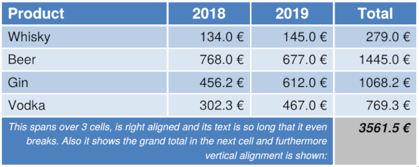
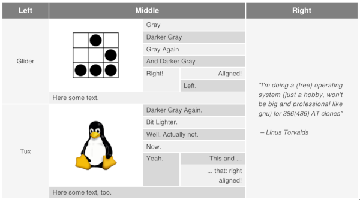
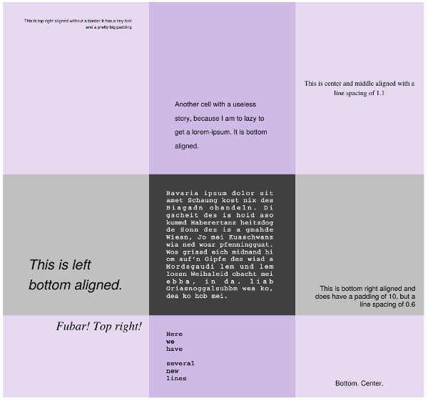

# easytable

This is a (very) small project that builds upon
[Apache's PDFBox](http://pdfbox.apache.org) (>= 2.0.4) and should allow you
to create tables in a fairly simple way.
It emerged from the need in another project. Therefore it also may miss some
crucial features. Nevertheless there is:
* setting font and font size on table, row and cell level
* setting single cells with bottom-, top-, left- and right-border width separately
* background color on table, row and cell level
* padding (top, bottom, left, right) on cell level
* border colors (on table, row or cell level)
* support for text alignment (right, left, center, justified)
* vertical text alignment (top, middle, bottom)
* cell spanning and row spanning 
* line breaking and line spacing
* images in cells

## Example

In order to produce a whole PDF document with a table that looks like this one:

You will need [this code](src/test/java/org/vandeseer/integrationtest/ExcelLikeExampleTest.java).
In the same file you find the code for this table: 

There are more examples (just see the folder), for instance this one: 

Again, just have a look at the [code](src/test/java/org/vandeseer/integrationtest/SettingsTest.java).

If you run the tests with `mvn clean test` there also some PDF documents created which you can find in the `target` folder.
The corresponding sources (in order to understand how to use the code) can be found in the test package.

## Installation

Add this to your `pom.xml`:

    <dependency>
        <groupId>com.github.vandeseer</groupId>
        <artifactId>easytable</artifactId>
        <version>0.4.3</version>
    </dependency>

Or checkout the repository and install it locally with maven (e.g. for the`develop` branch):

    mvn install -DskipTests -Dgpg.skip

## Kudos

- to [Binghammer](https://github.com/Binghammer) for implementing cell coloring and text center alignment
- to [Sebastian Göhring](https://github.com/TheSilentHorizon) for finding and fixing a bug (column spanning)
- to [AndreKoepke](https://github.com/AndreKoepke) for the line breaking feature, some bigger nice refactorings and 
improvements
- to [Wolfgang Apolinarski](https://github.com/wapolinar) for the printing over pages and bugfixes
- to [AdrianMiska](https://github.com/AdrianMiska) for finding and fixing an issue with cell height
- to [TheRealSourceSeeker](https://github.com/TheRealSourceSeeker) for finding a bug caused by using `float`s
- to [Drummond Dawson](https://github.com/drumonii) for code changes that allowed removing a dependency

## Q&A

### Can I customize the `TableDrawer` for my own specific needs?

Yep, have a look at those two classes: 
- (Using [Lombok](https://projectlombok.org/)): [EasytableCustomTableDrawer](src/test/java/org/vandeseer/custom/EasytableCustomTableDrawer.java)
- (Not using [Lombok](https://projectlombok.org/)): [EasytableNoLombokCustomTableDrawer](src/test/java/org/vandeseer/custom/EasytableNoLombokCustomTableDrawer.java)

### Does it work with Java < 8?

Nope. You will need Java 8.

### Does it work with PDFBox 1.8.9?

Well, Using it with PDFBox 1.8.9 requires you to check out version
0.0.7 (tagged as such in git) and install it locally, i.e.:

    git checkout v0.0.7
    mvn clean install

Note though that the API will have changed in the meantime ...

### Cool, I like it, can I buy you a beer?

Yes. Or you can upvote this answer on [stackoverflow](https://stackoverflow.com/questions/28059563/how-to-create-table-using-apache-pdfbox/42612456#42612456).
